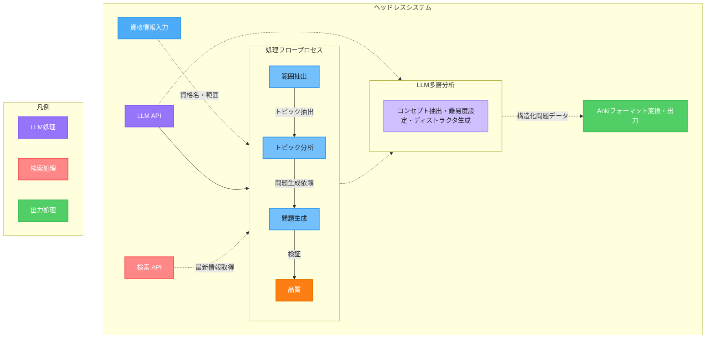

```mermaid
flowchart TD
    %% タイトルとスタイル設定
    classDef inputComponent fill:#4dabf7,stroke:#339af0,color:white,stroke-width:2px
    classDef llmComponent fill:#9775fa,stroke:#845ef7,color:white,stroke-width:2px
    classDef searchComponent fill:#ff8787,stroke:#fa5252,color:white,stroke-width:2px
    classDef processComponent fill:#74c0fc,stroke:#339af0,color:#212529,stroke-width:2px
    classDef analysisComponent fill:#d0bfff,stroke:#b197fc,color:#212529,stroke-width:2px
    classDef outputComponent fill:#51cf66,stroke:#40c057,color:white,stroke-width:2px
    classDef qualityComponent fill:#fd7e14,stroke:#e67700,color:white,stroke-width:2px

    %% メインフレーム
    subgraph headlessSystem["ヘッドレスシステム"]
        %% 入力コンポーネント
        input["資格情報入力"]:::inputComponent

        %% APIコンポーネント
        llmAPI["LLM API"]:::llmComponent
        searchAPI["検索 API"]:::searchComponent

        %% 処理フロー
        subgraph processFlow["処理フロープロセス"]
            scope["範囲抽出"]:::processComponent
            topic["トピック分析"]:::processComponent
            generation["問題生成"]:::processComponent
            quality["品質"]:::qualityComponent

            scope -->|"トピック抽出"| topic
            topic -->|"問題生成依頼"| generation
            generation -->|"検証"| quality
        end

        %% LLM多層分析
        subgraph llmAnalysis["LLM多層分析"]
            analysis["コンセプト抽出・難易度設定・ディストラクタ生成"]:::analysisComponent
        end

        %% 出力コンポーネント
        output["Ankiフォーマット変換・出力"]:::outputComponent

        %% 接続関係
        input -.->|"資格名・範囲"| processFlow
        llmAPI --> processFlow
        llmAPI -.-> llmAnalysis
        searchAPI -.->|"最新情報取得"| processFlow
        processFlow -.-> llmAnalysis
        llmAnalysis -.->|"構造化問題データ"| output
    end

    %% 凡例
    subgraph legend["凡例"]
        legend1["LLM処理"]:::llmComponent
        legend2["検索処理"]:::searchComponent
        legend3["出力処理"]:::outputComponent
    end
```
