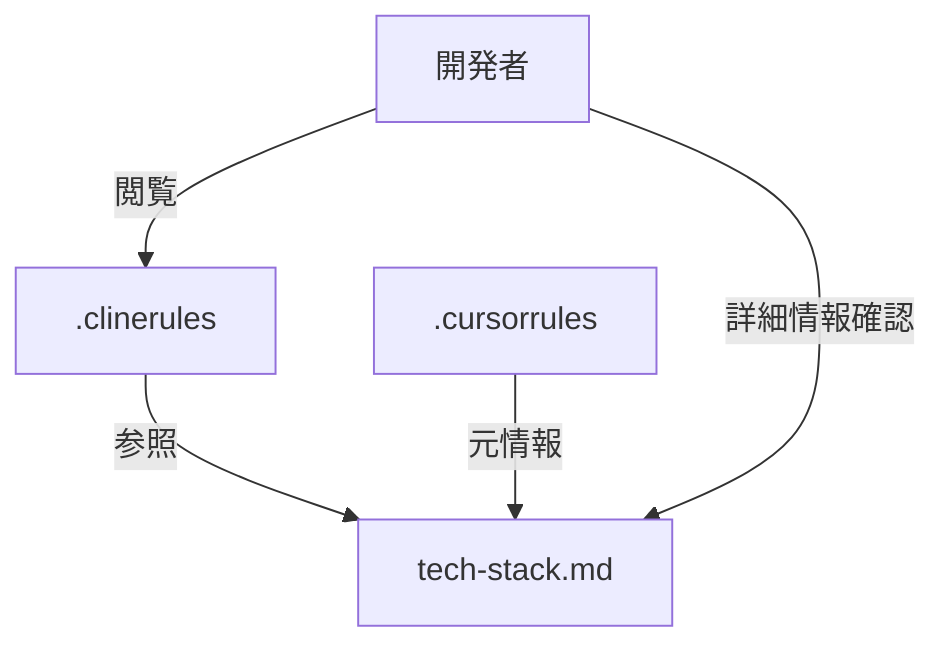

# `.clinerules`ファイル更新の実装プラン

## 目的
`tech-stack.md`に分離した技術情報を`.clinerules`ファイルから参照できるようにする

## 現状
- `.clinerules`ファイルには基本的な開発ルールのみが記載されています
- `.cursorrules`には同様のルールに加え、技術スタックなどのJSON情報も含まれています
- 新しく`tech-stack.md`ファイルを作成し、技術情報を分離しました

## 実装手順

1. `.clinerules`ファイルの最後に以下の内容を追加します：

```markdown
### しかくまるプロジェクト特有のルール
- LLM APIの利用は必ず抽象化レイヤーを通して行う
- 資格情報は常に暗号化して扱う
- 検索結果のキャッシュ機構を実装する
- Ankiフォーマットの厳密な検証を行う
- ユーザー入力の検証は必ず行う
- エラーハンドリングは詳細に実装する

## 技術情報
技術スタック、コードパターン、プロジェクト構造などの詳細技術情報は、以下のファイルを参照してください：

[しかくまるプロジェクト技術情報](./tech-stack.md)
```

## 実装イメージ図



## 実装後の検証方法
1. `.clinerules`から`tech-stack.md`へのリンクが正しく機能することを確認
2. 技術情報が分離されたことで、基本的なルールと技術的な詳細が適切に整理されていることを確認

## 注意点
- Architectモードでは`.md`ファイル以外は編集できないため、実際の`.clinerules`ファイルの編集はCodeモードに切り替えて行う必要があります